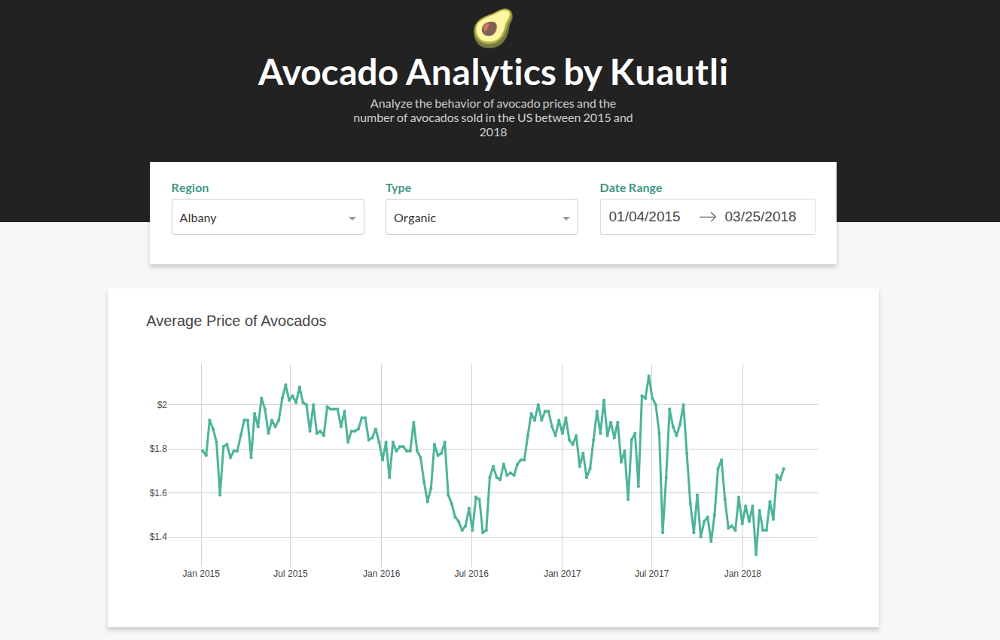

# 🥑 AvocadoDash

[](https://www.python.org/)
[](https://dash.plotly.com/)
[](https://pandas.pydata.org/)
[](https://python-poetry.org/)
[](https://www.docker.com/)
[](https://railway.app/)
[](LICENSE)

Un tablero web interactivo para analizar **precios y ventas de aguacates en Estados Unidos (2015–2018)**.  
Construido con **Python Dash**, incluye múltiples tipos de visualizaciones para una exploración integral de los datos.



---

## 📖 Versión en inglés

Para leer la documentación en inglés, visita: [README en inglés](./docs/README_EN.md)

---

## 🚀 Características

- **📊 Gráficas de Series de Tiempo Interactivas** – Analiza tendencias de precios y volúmenes de ventas
- **🔍 Filtros Avanzados** – Filtra por región, tipo de aguacate (convencional/orgánico) y rango de fechas
- **📈 Análisis con Diagramas de Dispersión** – Explora relaciones entre variables con ejes configurables
- **📦 Gráficas de Caja (Boxplots)** – Compara distribuciones por tipo, región o año
- **🎨 Diseño Responsivo** – Interfaz moderna y limpia con estilo personalizado
- **⚡ Actualizaciones en Tiempo Real** – Todos los gráficos se actualizan dinámicamente según los filtros

---

## 🛠️ Tecnologías

- **Python 3.12.6** – Lenguaje principal  
- **Dash 3.2.0** – Framework para aplicaciones web con Python  
- **Pandas 2.3.2** – Manipulación y análisis de datos  
- **Plotly** – Librería de gráficos interactivos (integrada en Dash)  
- **Poetry** – Gestión de dependencias y empaquetado  
- **Docker** – Contenerización para despliegue sencillo  
- **Railway** – Plataforma de despliegue en la nube  

---

## 📁 Estructura del Proyecto
```
AvocadoDash/
├── src/
│   ├── app.py              # Aplicación principal de Dash
│   ├── avocado.csv         # Dataset (ventas de aguacate en EE.UU. 2015-2018)
│   ├── utils.py            # Funciones utilitarias
│   └── assets/
│       ├── favicon.ico     # Ícono del sitio
│       └── style.css       # Estilos CSS personalizados
├── docker-compose.yml      # Configuración de Docker Compose
├── Dockerfile              # Configuración del contenedor Docker
├── pyproject.toml          # Dependencias con Poetry
├── poetry.lock             # Versiones bloqueadas de dependencias
├── railway.json            # Configuración de Railway
└── README.md
```
---

## 🔧 Instalación y Configuración

### Opción 1: Usando Poetry (Recomendado)

```bash
# Clonar el repositorio
git clone https://github.com/cuauhtemocbe/AvocadoDash.git
cd AvocadoDash

# Instalar Poetry (si no está instalado)
curl -sSL https://install.python-poetry.org | python3 -

# Instalar dependencias
poetry install

# Ejecutar la aplicación
poetry run python src/app.py
```

Abrir en el navegador 👉 `http://localhost:8050`

---

### Opción 2: Usando Docker

```bash
git clone https://github.com/cuauhtemocbe/AvocadoDash.git
cd AvocadoDash

docker build -t avocado-dash .
docker run -p 8050:8050 avocado-dash
```

---

### Opción 3: Usando Docker Compose

```bash
docker-compose up --build
```

---

## 📊 Descripción de los Datos

- **Periodo**: 2015 – 2018  
- **Regiones**: Más de 54 mercados en EE.UU.  
- **Tipos**: Convencional y Orgánico  
- **Métricas**: Precio Promedio, Volumen Total, Códigos PLU (4046, 4225, 4770), Ventas en bolsas (S, L, XL)  

---

## 🎯 Guía de Uso

### Tablero Principal
- Filtra por **Región**, **Tipo** y **Rango de Fechas**  
- Los gráficos se actualizan al instante  

### Gráfica de Dispersión
- Selecciona variables para los ejes **X/Y**  
- Los puntos se colorean por tipo de aguacate  
- Al pasar el cursor se muestra información detallada (región y fecha)  

### Boxplot
- Agrupa por tipo, región o año  
- Identifica valores atípicos y compara distribuciones  

---

## 🌐 Demo en Línea

👉 [AvocadoDash en Railway](https://avocadodash-production.up.railway.app/)

---

## 🤝 Contribuciones

¡Se aceptan Pull Requests!  
Para cambios mayores, abre un issue primero para discutir la propuesta.

---

## 📝 Licencia

Este proyecto está bajo la licencia [MIT](LICENSE).

---

## 🙏 Agradecimientos

- Inspiración del tutorial: [Real Python – Dash Tutorial](https://realpython.com/python-dash/)  
- Fuente de datos: **Hass Avocado Board**

---

## 👨‍💻 Autor

Creado por [@Kuautli](https://github.com/cuauhtemocbe)

---