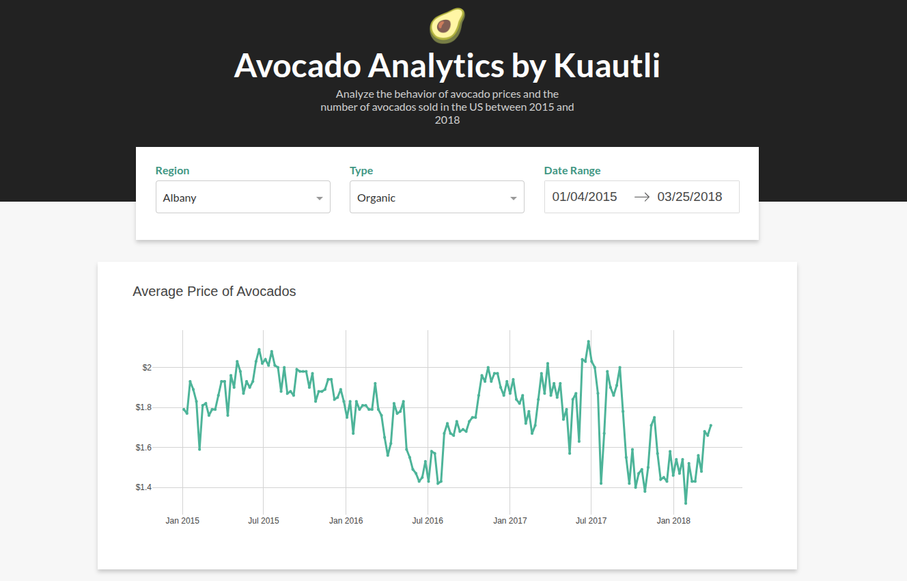

# 🥑 AvocadoDash

[](https://www.python.org/)
[](https://dash.plotly.com/)
[](https://pandas.pydata.org/)
[](https://python-poetry.org/)
[](https://www.docker.com/)
[](https://railway.app/)
[](LICENSE)

An interactive web dashboard for analyzing **avocado prices and sales data in the United States (2015–2018)**.  
Built with **Python Dash**, featuring multiple visualization types for comprehensive data exploration.



---

## 🚀 Features

- **📊 Interactive Time Series Charts** – Analyze price trends and sales volume over time
- **🔍 Advanced Filtering** – Filter by region, avocado type (conventional/organic), and date range
- **📈 Scatter Plot Analysis** – Explore relationships between variables with customizable axes
- **📦 Box Plot Visualizations** – Compare distributions by type, region, or year
- **🎨 Responsive Design** – Clean, modern UI with custom styling
- **⚡ Real-time Updates** – All charts update dynamically based on filters

---

## 🛠️ Technology Stack

- **Python 3.12.6** – Core programming language  
- **Dash 3.2.0** – Web application framework for Python  
- **Pandas 2.3.2** – Data manipulation and analysis  
- **Plotly** – Interactive charting (via Dash)  
- **Poetry** – Dependency management and packaging  
- **Docker** – Containerization for easy deployment  
- **Railway** – Cloud deployment platform  

---

## 📁 Project Structure
```
AvocadoDash/
├── src/
│   ├── app.py              # Main Dash application
│   ├── avocado.csv         # Dataset (US avocado sales 2015-2018)
│   ├── utils.py            # Utility functions
│   └── assets/
│       ├── favicon.ico     # Site icon
│       └── style.css       # Custom CSS styling
├── docker-compose.yml      # Docker Compose configuration
├── Dockerfile              # Docker container setup
├── pyproject.toml          # Poetry dependencies
├── poetry.lock             # Locked dependency versions
├── railway.json            # Railway deployment config
└── README.md
```
---

## 🔧 Installation & Setup

### Option 1: Using Poetry (Recommended)

# Clone repo
git clone https://github.com/cuauhtemocbe/AvocadoDash.git
cd AvocadoDash

# Install Poetry (if not installed)
curl -sSL https://install.python-poetry.org | python3 -

# Install dependencies
poetry install

# Run application
poetry run python src/app.py

Open your browser at 👉 http://localhost:8050

---

### Option 2: Using Docker

git clone https://github.com/cuauhtemocbe/AvocadoDash.git
cd AvocadoDash

docker build -t avocado-dash .
docker run -p 8050:8050 avocado-dash

---

### Option 3: Using Docker Compose

docker-compose up --build

---

## 📊 Data Overview

- **Time Period**: 2015 – 2018  
- **Regions**: 54+ US markets  
- **Types**: Conventional & Organic  
- **Metrics**: Avg. Price, Total Volume, PLU codes (4046, 4225, 4770), Bag sales (S, L, XL)  

---

## 🎯 Usage Guide

### Dashboard
- Filter by **Region**, **Type**, and **Date Range**  
- Charts update instantly  

### Scatter Plot
- Choose **X/Y variables**  
- Points color-coded by type  
- Hover for region/date details  

### Box Plot
- Group by type, region, or year  
- Detect outliers & compare distributions  

---

## 🌐 Live Demo

👉 AvocadoDash on Railway: https://avocadodash-production.up.railway.app/

---

## 🤝 Contributing

Pull Requests welcome!  
For major changes, open an issue first to discuss improvements.

---

## 📝 License

This project is under the MIT License.

---

## 🙏 Acknowledgments

- Tutorial inspiration: Real Python – Dash Tutorial  
- Data source: Hass Avocado Board

---

## 👨‍💻 Author

Created by @Kuautli (https://github.com/cuauhtemocbe)

---